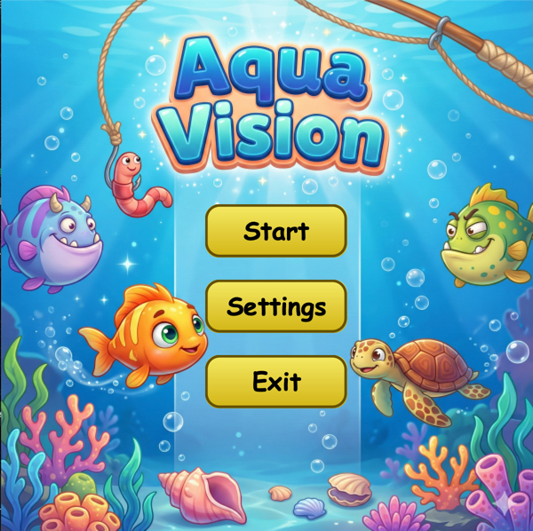
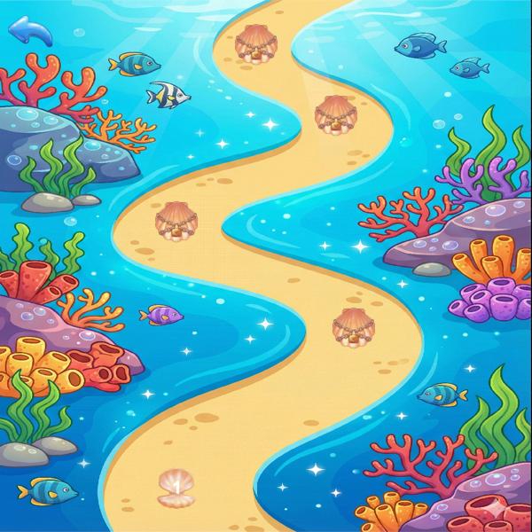
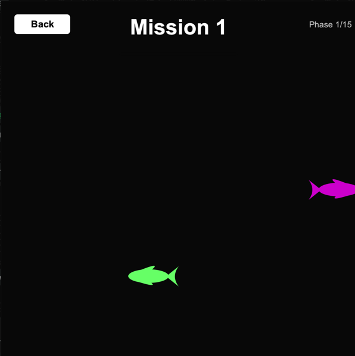
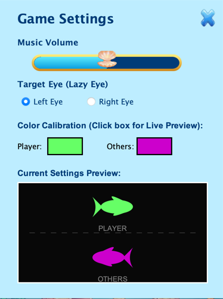
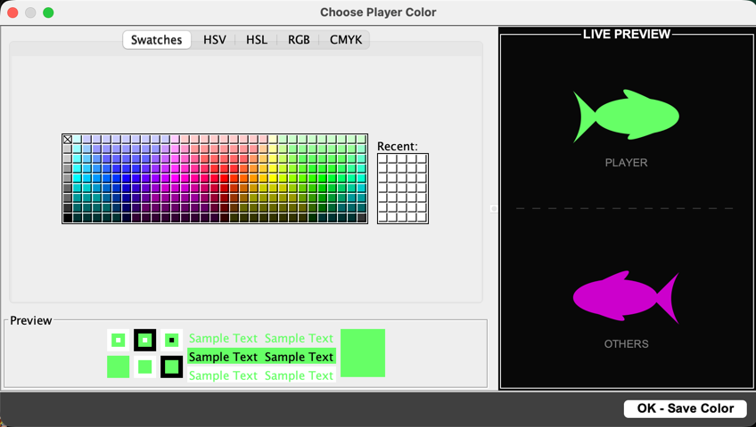

🐟 Dichoptic Amblyopia Therapy Game

> A serious game leveraging dichoptic training principles for amblyopia treatment through binocular visual stimulation and interactive gameplay.

---

📖 Overview

This project presents a Serious Game designed to support the clinical treatment of Amblyopia (Lazy Eye) through evidence-based dichoptic training methodology. Unlike conventional video games, this application enforces binocular vision usage by presenting separate, complementary visual stimuli to each eye using Anaglyph 3D technology (Red/Cyan glasses).

Core Therapeutic Approach

- Amblyopic Eye: Assigned primary task (enemy fish)
- Dominant Eye: Processes environmental obstacles (player control fish)
- Therapeutic Goal: Force binocular fusion for successful gameplay

The application employs a high-contrast black background to minimize visual noise and isolate targeted photoreceptor stimulation, ensuring maximum therapeutic efficacy.

---

🎨 Game Screenshots

<b>📸 Click to view game screenshots</b>

 

  
*Main menu with gradient rounded buttons and ocean-themed background*

  
*Mission selection screen with level unlocking system and shell icons*

  
*Dichoptic fish rendering with real-time phase progression tracking*

  
*Configuration interface with live color calibration preview*

  
*Real-time dichoptic color adjustment with live fish preview*

---

🧠 Clinical & Scientific Rationale

<b>📚 Click to expand scientific background</b>

 

Background

Traditional amblyopia treatment relies primarily on monocular occlusion (eye patching), which presents several limitations:
- Poor patient compliance, especially in pediatric populations
- Limited binocular function recovery
- Potential for reverse amblyopia

Evidence-Based Design

Contemporary research demonstrates that dichoptic stimulation can significantly improve:
- Binocular visual function
- Contrast sensitivity thresholds
- Stereoscopic depth perception
- Visual acuity in the amblyopic eye

Therapeutic Mechanisms

This application implements dichoptic principles through:

1. Suppression Reduction: Diminishing dominance of the stronger eye
2. Task Relevance: Increasing visual processing demands on the amblyopic eye
3. Binocular Cooperation: Enforcing integration of both visual streams for task success
4. Cognitive Load Management: Minimalist design maintains focus on visual processing

---

✨ Key Features

🎯 Dichoptic Rendering Engine
- Dynamic color channel separation based on lazy eye configuration
- Real-time RGB calibration for optimal channel isolation
- Anti-aliasing and resolution-independent vector rendering

🧪 Clinically Inspired Motion Patterns

| Pattern | Therapeutic Target | Description |
|---------|-------------------|-------------|
| Saccadic | Rapid eye movements | Quick, discrete position changes |
| Smooth Pursuit | Tracking ability | Continuous smooth motion paths |
| Vergence | Depth processing | Convergence/divergence stimulation |
| Peripheral Awareness | Visual field expansion | Off-axis motion detection |

📊 Comprehensive Progress Tracking
- SQLite-based persistence with full ACID compliance
- Detailed session metrics (mission progress, failure analysis, attempt counts)
- Timestamped performance history for longitudinal analysis
- Export-ready data structure for clinical review

⚙️ Custom Calibration System
- Fine-grained RGB value adjustment (0-255 per channel)
- Support for various anaglyph glasses brands/specifications
- Per-eye contrast balancing
- Real-time preview during calibration

📈 Progressive Difficulty System
- 5 Missions × 15 Phases = 75 unique challenge levels
- Parametric difficulty scaling:
  - Enemy spawn rate
  - Movement speed multipliers
  - Trajectory complexity
  - Density and clustering patterns

---

🎮 Game Mechanics

<b>🕹️ Click to view game mechanics</b>

 

Concept
Navigate a bioluminescent fish through a dark aquatic environment while avoiding predators. Success requires functional binocular vision—each eye contributes essential information.

Rules & Constraints

1. Hardware: Red/Cyan anaglyph glasses (required)
2. Visual Separation:
   - Left eye (red filter): Perceives player fish only
   - Right eye (cyan filter): Perceives enemy fish only
   - (Configuration inverts based on lazy eye selection)
3. Fusion Requirement: Brain must merge both visual inputs to succeed
4. Failure Condition: Collision with any enemy fish
5. Progression: Complete 15 phases per mission to unlock the next

Therapeutic Session Guidelines

- Duration: 15-20 minutes per session
- Frequency: 3-5 sessions per week (recommended)
- Environment: Low ambient light, minimal distractions
- Posture: Comfortable viewing distance (40-60cm from screen)

---

🛠 Technical Architecture

<b>⚙️ Technology Stack</b>

 

| Component | Technology | Version |
|-----------|-----------|---------|
| Language | Java | 21+ |
| GUI Framework | Swing | Built-in |
| Graphics | Java2D (Graphics2D) | Built-in |
| Database | SQLite | 3.40+ |
| JDBC Driver | sqlite-jdbc | Latest |

<b>📂 Application Structure</b>

 
<pre>
src/
├── Main.java                        # Application entry point with icon & sound initialization
├── ui/
│   ├── BasePanel.java              # Base JPanel class (600x600, null layout)
│   ├── StartPanel.java             # Main menu with gradient rounded buttons
│   ├── MissionPanel.java           # Mission selection screen with level unlocking
│   ├── SettingPanel.java           # Configuration interface with live color preview
│   └── Game.java                   # Core gameplay panel with phase system
├── model/
│   ├── Player.java                 # Player fish entity (inside Game.java)
│   ├── EnemyFish.java              # Enemy fish entity (inside Game.java)
│   ├── PhaseData.java              # Phase statistics data class (inside Game.java)
│   ├── PatternManager.java         # Movement pattern factory (inside Game.java)
│   ├── FishPattern.java            # Pattern container (inside Game.java)
│   └── SpawnInstruction.java       # Spawn timing data (inside Game.java)
├── config/
│   ├── LazyEyeConfig.java          # Dichoptic color channel configuration
│   └── FishColorConfig.java        # Legacy color configuration (deprecated)
├── rendering/
│   └── FishRenderer.java           # Vector-based fish rendering with Path2D
├── audio/
│   └── SoundManager.java           # Background music and volume control
└── persistence/
    └── DatabaseManager.java        # SQLite integration for progress & settings

resources/
├── progress.db                     # Auto-generated SQLite database
├── appLogo.png                     # Application icon
├── background.png                  # Main menu background
├── MissionBackground.png           # Mission selection background
├── level_active.png                # Unlocked mission icon
├── level_locked.png                # Locked mission icon
├── return.png                      # Return button icon
├── close.png                       # Close button icon
└── Child_Game_Bg_Music.wav         # Background music file
</pre>

<b>🔄 Panel Hierarchy & Navigation Flow</b>

 
<pre>
Main.java
  └── Creates JFrame (600x600, undecorated)
       │
       └── StartPanel (Main Menu)
            ├── RoundedButton: "Start" → MissionPanel
            ├── RoundedButton: "Settings" → SettingPanel (JDialog)
            └── RoundedButton: "Exit" → System.exit(0)
                 │
                 ├── MissionPanel (Mission Selection)
                 │    ├── Return Button → StartPanel
                 │    └── Level Buttons (1-5) → Game (in new JFrame)
                 │         │
                 │         └── Game (Gameplay)
                 │              ├── ESC Key → PauseDialog (JDialog)
                 │              │    ├── Resume → Continue game
                 │              │    ├── Restart → restartMission()
                 │              │    ├── Return to Missions → Close JFrame
                 │              │    └── Exit → System.exit(0)
                 │              │
                 │              ├── On Collision → ResultDialog (JDialog - Failure)
                 │              │    ├── Try Again → restartMission()
                 │              │    └── Exit → returnToMissionPanel()
                 │              │
                 │              └── On Completion → ResultDialog (JDialog - Success)
                 │                   └── Continue → returnToMissionPanel() + unlock next level
                 │
                 └── SettingPanel (Configuration Dialog)
                      ├── Music Volume Slider (Custom SeaSliderUI)
                      ├── Eye Selection (RadioButtons: Left/Right)
                      ├── Color Calibration Boxes
                      │    ├── Click Player Box → Live Color Dialog
                      │    └── Click Enemy Box → Live Color Dialog
                      ├── Preview Panel (with FishRenderer)
                      └── Close Button → Dispose dialog
</pre>

---

🧩 Core Systems

<b>1️⃣ LazyEyeConfig</b>

 

Purpose: Centralized dichoptic color channel management

Key Features:
- Stores base player and enemy colors
- Inverts color assignment based on lazy eye selection
- Provides getPlayerColor() and getEnemyColor() methods that return appropriately swapped colors
- Integrates with DatabaseManager for persistent settings

Implementation:
<pre>
private static boolean isRightEyeSelected = false;
private static Color basePlayerColor = new Color(0, 100, 255);  // Cyan
private static Color baseEnemyColor = new Color(200, 0, 0);     // Red

public static Color getPlayerColor() {
    return isRightEyeSelected ? baseEnemyColor : basePlayerColor;
}

public static Color getEnemyColor() {
    return isRightEyeSelected ? basePlayerColor : baseEnemyColor;
}
</pre>

<b>2️⃣ PatternManager</b>

 

Purpose: Therapeutic motion pattern generation

Pattern Design Philosophy:
- Phase 0-2: Warm-up with simple horizontal/vertical tracking
- Phase 3-5: Diagonal pursuit and smooth pursuit training
- Phase 6-7: Convergence and divergence exercises
- Phase 8-9: Figure-8 simulation and peripheral awareness
- Phase 10-11: Advanced vergence and rapid tracking
- Phase 12-13: Circular pursuit and complex vergence
- Phase 14: Final boss with combined challenges

Difficulty Scaling:
<pre>
double baseSpeed = 1.2 + (mission * 0.3);
double complexityFactor = 1.0 + (mission - 1) * 0.15;
int extraFish = Math.max(0, (mission - 1));

Example Pattern (Phase 3 - Diagonal Pursuit):
pattern.addSpawn(0, -50, -50, baseSpeed, baseSpeed * 0.8, 30);
pattern.addSpawn(600, 650, 650, -baseSpeed, -baseSpeed * 0.8, 30);
</pre>

<b>3️⃣ DatabaseManager</b>

 

Purpose: Clinical data persistence and progress tracking

Database Schema:
<pre>
CREATE TABLE mission_progress (
    mission INTEGER PRIMARY KEY,
    total_attempts INTEGER DEFAULT 0,
    successful_completions INTEGER DEFAULT 0,
    highest_phase_reached INTEGER DEFAULT 0,
    last_updated TEXT DEFAULT CURRENT_TIMESTAMP
);

CREATE TABLE user_settings (
    id INTEGER PRIMARY KEY CHECK (id = 1),
    lazy_eye_right INTEGER DEFAULT 0,
    player_color INTEGER NOT NULL,
    enemy_color INTEGER NOT NULL,
    last_updated TEXT DEFAULT CURRENT_TIMESTAMP
);
</pre>
Key Methods:
- incrementAttempt(mission): Records new attempt
- updateHighestPhase(mission, phase): Updates progress
- incrementCompletion(mission): Records successful completion
- getProgressReport(mission): Retrieves formatted statistics
- saveUserSettings(): Persists calibration settings
- loadUserSettings(): Restores settings on startup

<b>4️⃣ FishRenderer</b>

 

Purpose: High-fidelity vector-based fish rendering

Rendering Features:
- Path2D.Double for resolution-independent geometry
- Anti-aliasing with RenderingHints
- Compound shapes: Body (oval) + Tail + Top Fin + Bottom Fin
- Horizontal flip support via AffineTransform
- 0.85x scaling for collision padding
- Color channel filtering per entity type

Fish Anatomy Rendering:
<pre>
public static void drawFish(Graphics2D g2d, int x, int y, int width, int height, 
                           Color color, boolean facingRight) {
    // Tail: Quadratic bezier curve
    // Top Fin: Quadratic bezier curve
    // Bottom Fin: Quadratic bezier curve  
    // Body: Filled oval
}
</pre>

<b>5️⃣ Game Phase System</b>

 

Purpose: Progressive difficulty and structured gameplay

Phase Progression Logic:
- Each phase has predefined spawn patterns
- Phase starts when all previous enemies are cleared
- Collision triggers immediate failure and data recording
- Successful phase completion updates database
- 15 phases per mission = complete therapeutic session

Phase Data Tracking:
<pre>
class PhaseData {
    int missionNumber;
    int phaseNumber;
    long startTime;
    long endTime;
    long survivedDuration;
    boolean completed;
}
</pre>

<b>6️⃣ Custom UI Components</b>

 

RoundedButton (StartPanel):
- Gradient paint (light yellow to dark gold)
- Rounded rectangle shape with configurable arc
- Hover and press states with color brightening/darkening
- Comic Sans MS font for friendly appearance
- Mouse containment check for rounded hit detection

SeaSliderUI (SettingPanel):
- Custom slider track with rounded rectangle
- Gradient fill showing current value
- Image-based thumb (shell icon)
- Ocean-themed color palette (cyan to dark blue)
- Integrates with SoundManager for volume control

---

📊 Data Collection & Analytics

<b>📈 Tracked Metrics</b>

 

| Metric | Description | Clinical Value |
|--------|-------------|----------------|
| Mission ID | Which therapeutic module | Task-specific performance |
| Total Attempts | Number of tries | Engagement tracking |
| Successful Completions | Times fully completed | Success rate analysis |
| Highest Phase Reached | Maximum progression | Difficulty calibration |
| Phase Duration | Time per phase | Endurance measurement |
| Collision Phase | Where failures occur | Difficulty hot-spot identification |
| Session Timestamp | When played | Compliance tracking |

Progress Report Format:
"Attempts: 12 | Successful: 3 | Success Rate: 25.0% | Highest Phase: 14/15"

<b>🔮 Future Analytics Extensions</b>

 

- Performance Visualization: Chart success rates across missions
- CSV Export: Export progress.db for external analysis
- Adaptive Difficulty: ML-based speed/density adjustment
- Comparative Analysis: Multi-patient anonymized benchmarking
- Heat Maps: Collision location visualization
- Learning Curves: Track improvement over time
- Compliance Dashboard: Session frequency monitoring

---

🧪 Therapeutic Design Principles

<b>🎯 Click to view therapeutic principles</b>

 

| Principle | Implementation | Therapeutic Benefit |
|-----------|---------------|---------------------|
| Binocular Fusion | LazyEyeConfig color inversion | Reduces suppression, promotes fusion |
| Contrast Balancing | RGB calibration with live preview | Equalizes inter-ocular rivalry |
| Neural Plasticity | 15 short phases × 5 missions | Facilitates cortical reorganization |
| Eye Movement Training | 15 pattern types with mathematical trajectories | Improves oculomotor control |
| Peripheral Stimulation | Off-axis spawning (-50 to 650 pixels) | Expands functional visual field |
| Progressive Overload | Mission-based difficulty scaling | Ensures continuous improvement |
| Immediate Feedback | Collision detection with ResultDialog | Reinforces correct fusion behavior |

Movement Pattern Types (Phase-Based):

Phase 0-2: WARM-UP
- Horizontal tracking (left-to-right, right-to-left)
- Vertical tracking (top-to-bottom)
- Single fish, slow speed (baseSpeed * 0.9)

Phase 3-5: BASIC TRACKING
- Diagonal pursuit (45° angles)
- Smooth pursuit (constant velocity)
- Saccadic training (discrete position jumps)

Phase 6-7: VERGENCE TRAINING
- Convergence (fish moving toward center)
- Divergence (fish moving away from center)
- Multiple simultaneous fish

Phase 8-10: COMPLEX PATTERNS
- Figure-8 simulation
- Peripheral awareness (extreme off-axis)
- Advanced vergence (crossing patterns)

Phase 11-13: RAPID CHALLENGES
- Rapid tracking (6+ fish in sequence)
- Circular pursuit (curved trajectories)
- Counter-rotating patterns

Phase 14: FINAL BOSS
- Combines all pattern types
- Maximum speed and density
- Ultimate binocular integration test

---

🚀 Installation & Setup

<b>💻 Prerequisites</b>

 

- Java Development Kit (JDK): Version 21 or higher
  Download: https://www.oracle.com/java/technologies/downloads/
  
- SQLite JDBC Driver: sqlite-jdbc-3.44.1.0.jar or later
  Download: https://github.com/xerial/sqlite-jdbc
  
- Red/Cyan Anaglyph Glasses: Hardware requirement for therapeutic efficacy
  Recommended: Standard cardboard red/cyan 3D glasses
  
- Audio Support: Java Sound API (built-in)

<b>⚙️ Installation Steps</b>

 

1. Clone the Repository
<pre>
   git clone https://github.com/clerancebae/AquaVisionx.git
   cd AquaVisionx
</pre>
2. Set Up Dependencies
   
   Option A: Manual Classpath
   - Download sqlite-jdbc-3.44.1.0.jar
   - Place in project root or lib/ folder
   
   Option B: Maven (create pom.xml)
   <dependency>
       <groupId>org.xerial</groupId>
       <artifactId>sqlite-jdbc</artifactId>
       <version>3.44.1.0</version>
   </dependency>

3. Configure Resources
   Ensure resources/ folder contains:
   - appLogo.png (application icon)
   - background.png (main menu background)
   - MissionBackground.png (mission selection background)
   - level_active.png (unlocked mission icon)
   - level_locked.png (locked mission icon)
   - return.png (return button icon)
   - close.png (settings close button)
   - Child_Game_Bg_Music.wav (background music)

4. Configure IDE
   
   IntelliJ IDEA:
   - Open project
   - File → Project Structure → Libraries → Add JAR (sqlite-jdbc)
   - Mark resources/ as "Resources Root"
   - Build → Build Project
   
   Eclipse:
   - Import → Existing Projects into Workspace
   - Right-click project → Build Path → Add External JARs
   - Add resources/ to build path
   
   VS Code:
   - Install "Extension Pack for Java"
   - Update .vscode/settings.json with classpath
   - Ensure resources/ is in source path

5. Run Application
   
   Command Line:
   # Linux/Mac
   java -cp .:sqlite-jdbc-3.44.1.0.jar:resources Main
   
   # Windows
   java -cp .;sqlite-jdbc-3.44.1.0.jar;resources Main
   
   IDE:
   - Run Main.java directly
   - Ensure VM options include: -Dsun.java2d.opengl=true (optional, for performance)

6. First Launch
   - progress.db is automatically created in project root
   - Default settings: Left eye lazy, cyan player, red enemy
   - Background music starts automatically
   - Navigate to Settings to configure your lazy eye

<b>🔧 Troubleshooting</b>

 

Issue: "ClassNotFoundException: org.sqlite.JDBC"
Solution: Ensure sqlite-jdbc JAR is in classpath. Check IDE library configuration.

Issue: "Image not found! Check path and Resources Root."
Solution: Mark resources/ folder as "Resources Root" in IDE. Verify file paths.

Issue: No sound playing
Solution: Check Child_Game_Bg_Music.wav exists and is valid WAV format. Verify file path.

Issue: Graphics rendering issues or slow performance
Solution: Enable hardware acceleration with -Dsun.java2d.opengl=true flag

Issue: Database locked error
Solution: Close all other instances of the application. Delete progress.db to reset.

Issue: Color calibration not saving
Solution: Check database write permissions. Verify user_settings table exists.

---

🧩 Extensibility & Future Work

<b>🚀 Planned Enhancements</b>

 

- [ ] Adaptive Difficulty Engine: ML-based performance modeling
      Track player performance across missions and automatically adjust
      baseSpeed and complexityFactor parameters
      
- [ ] VR/AR Support: OpenXR integration for true stereoscopic rendering
      Replace anaglyph with proper left/right eye rendering
      Enhanced depth perception for vergence training
      
- [ ] Eye-Tracking Integration: Tobii/Pupil Labs SDK support
      Measure actual eye movements during gameplay
      Validate therapeutic efficacy with objective metrics
      
- [ ] Therapist Dashboard: Web-based patient monitoring portal
      Export progress.db to cloud storage
      Generate clinical reports with charts and statistics
      Multi-patient management interface
      
- [ ] Multiplayer Mode: Collaborative binocular challenges
      Two players must cooperate using dichoptic vision
      Shared fish that require both players to see
      
- [ ] Localization: i18n support (Turkish, English, Spanish)
      ResourceBundle implementation
      Culturally appropriate graphics and themes
      
- [ ] Accessibility: Screen reader support, colorblind modes
      High contrast modes
      Keyboard-only navigation
      Adjustable font sizes

Extension Points:

Custom Pattern Plugin Interface:
<pre>
public interface TherapyPattern {
    Path2D generate(double time, DifficultyLevel level);
    String getTherapeuticGoal();
    int getRecommendedPhase();
}
</pre>
// Example implementation:
<pre>
public class SpiralPattern implements TherapyPattern {
    @Override
    public Path2D generate(double time, DifficultyLevel level) {
        // Generate spiral trajectory
    }
}
</pre>

Custom Data Exporter:
<pre>
public interface DataExporter {
    void export(List<PhaseData> phases, String format);
    boolean supportsFormat(String format);
}
</pre>
// Usage:
DataExporter csvExporter = new CSVExporter();
csvExporter.export(phaseRecords, "csv");

Custom Fish Renderer:
<pre>
public interface FishDrawable {
    void draw(Graphics2D g2d, int x, int y, int width, int height, 
              Color color, boolean facingRight);
}
</pre>
// Allows different visual styles (realistic, cartoon, abstract)

Database Migration System:
<pre>
public class DatabaseMigration {
    public static void migrateV1toV2() {
        // Add new columns, preserve existing data
    }
}
</pre>

---

🧑‍⚕️ Target Audience

Primary Users
- Serious Games Researchers: Novel therapeutic game design studies
- Medical Informatics Students: Health IT application development projects
- HCI Practitioners: Accessibility and therapeutic interface design
- Vision Science Researchers: Binocular vision rehabilitation studies
- Software Engineering Students: Game architecture and design patterns

Secondary Users
- Clinical Ophthalmologists: Supplementary patient treatment tool
- Optometry Clinics: Home therapy prescription for amblyopia patients
- Rehabilitation Centers: Pediatric amblyopia treatment programs
- Computer Science Educators: Teaching example for Swing GUI applications

---

📚 Academic Context

<b>🎓 Academic Applications</b>

 

Suitable For

| Program | Application |
|---------|-------------|
| Bachelor's Thesis | Software engineering, game design, medical informatics |
| Master's Thesis | Serious games, visual neuroscience, HCI research |
| TÜBİTAK 2209 | Undergraduate research projects in health IT |
| TÜBİTAK 2241 | Industry-oriented final year projects |
| PhD Research | Therapeutic gaming, vision rehabilitation technology |

Relevant Research Domains

- Human-Centered Computing (HCI)
- Applied Computer Vision
- Medical Serious Games
- Rehabilitation Technology
- Visual Neuroscience
- Gamification in Healthcare
- Binocular Vision Research
- Dichoptic Training Methodologies

Potential Publications

- IEEE Transactions on Games
- Journal of Medical Internet Research (JMIR)
- Computers in Human Behavior
- International Conference on Serious Games (ICSG)
- ACM CHI Conference (Human-Computer Interaction)
- Vision Research
- Optometry and Vision Science

Sample Research Questions

1. Does dichoptic gaming improve amblyopic eye function more than traditional patching?
2. What difficulty progression optimizes therapeutic outcomes while maintaining engagement?
3. How does color calibration affect binocular fusion success rates?
4. Can gameplay metrics predict real-world visual acuity improvements?
5. What is the optimal session duration and frequency for dichoptic training?

---

⚠️ Medical Disclaimer

IMPORTANT: This software is a research and educational prototype.

- ❌ NOT a medical device
- ❌ NOT FDA/CE/TGA approved
- ❌ NOT a replacement for professional ophthalmological treatment
- ❌ NOT validated in clinical trials
- ✅ MUST be used under appropriate clinical supervision
- ✅ SHOULD complement existing amblyopia therapy protocols
- ✅ MAY be used for research purposes with proper IRB approval

Consult a licensed ophthalmologist or optometrist before use.

Do not discontinue prescribed treatments without medical consultation.

This software is provided "as-is" without any warranty of effectiveness.

---

📜 License

MIT License

Copyright (c) 2025 clerancebae

Permission is hereby granted, free of charge, to any person obtaining a copy
of this software and associated documentation files (the "Software"), to deal
in the Software without restriction, including without limitation the rights
to use, copy, modify, merge, publish, distribute, sublicense, and/or sell
copies of the Software, and to permit persons to whom the Software is
furnished to do so, subject to the following conditions:

The above copyright notice and this permission notice shall be included in all
copies or substantial portions of the Software.

THE SOFTWARE IS PROVIDED "AS IS", WITHOUT WARRANTY OF ANY KIND, EXPRESS OR
IMPLIED, INCLUDING BUT NOT LIMITED TO THE WARRANTIES OF MERCHANTABILITY,
FITNESS FOR A PARTICULAR PURPOSE AND NONINFRINGEMENT. IN NO EVENT SHALL THE
AUTHORS OR COPYRIGHT HOLDERS BE LIABLE FOR ANY CLAIM, DAMAGES OR OTHER
LIABILITY, WHETHER IN AN ACTION OF CONTRACT, TORT OR OTHERWISE, ARISING FROM,
OUT OF OR IN CONNECTION WITH THE SOFTWARE OR THE USE OR OTHER DEALINGS IN THE
SOFTWARE.

This project may be used, modified, and distributed for academic and 
non-commercial purposes with proper attribution.

---

🙌 Acknowledgements

- Contemporary dichoptic therapy research literature (Li et al., Hess et al.)
- Java Swing and Java2D community resources
- SQLite and xerial/sqlite-jdbc open-source contributors

Special Thanks:
- Beta testers and early adopters
- Clinical advisors who provided therapeutic guidance
- Computer science educators who reviewed the code architecture

---

📞 Contact & Support

- GitHub Issues: https://github.com/clerancebae/AquaVision/issues
- Discussions: https://github.com/clerancebae/AquaVision/discussions
- Email: kilic-berke@hotmail.com , birbenbeyza07@gmail.com

For Clinical Inquiries:
Please consult with your ophthalmologist or vision therapist regarding 
the suitability of this software for your specific case.

For Technical Support:
Open an issue on GitHub with:
- Java version (java -version)
- Operating system
- Error messages or screenshots
- Steps to reproduce the problem

---

📈 Version History

v1.0.0 (2025-01-XX) - Initial Release
- 5 missions with 15 phases each
- SQLite progress tracking
- Live color calibration
- Background music system
- Custom rounded UI components

Planned for v1.1.0:
- CSV export functionality
- Performance charts
- Additional missions (6-10)
- Enhanced sound effects

---

🔒 Security & Privacy

Data Storage:
- All data stored locally in progress.db
- No internet connection required
- No telemetry or analytics collection
- No personal information collected

Recommended Practices:
- Keep progress.db backed up for long-term studies
- Do not share progress.db files (may contain patient data)
- Use unique installations per patient in clinical settings
- Consider encryption for sensitive clinical deployments

---

Made with ❤️ for vision science and therapeutic gaming

⭐ Star this repo: https://github.com/clerancebae/AquaVision  
🐛 Report Bug: https://github.com/clerancebae/AquaVision/issues  
💡 Request Feature: https://github.com/clerancebae/AquaVision/issues  
📖 Wiki: https://github.com/clerancebae/AquaVision/wiki  
